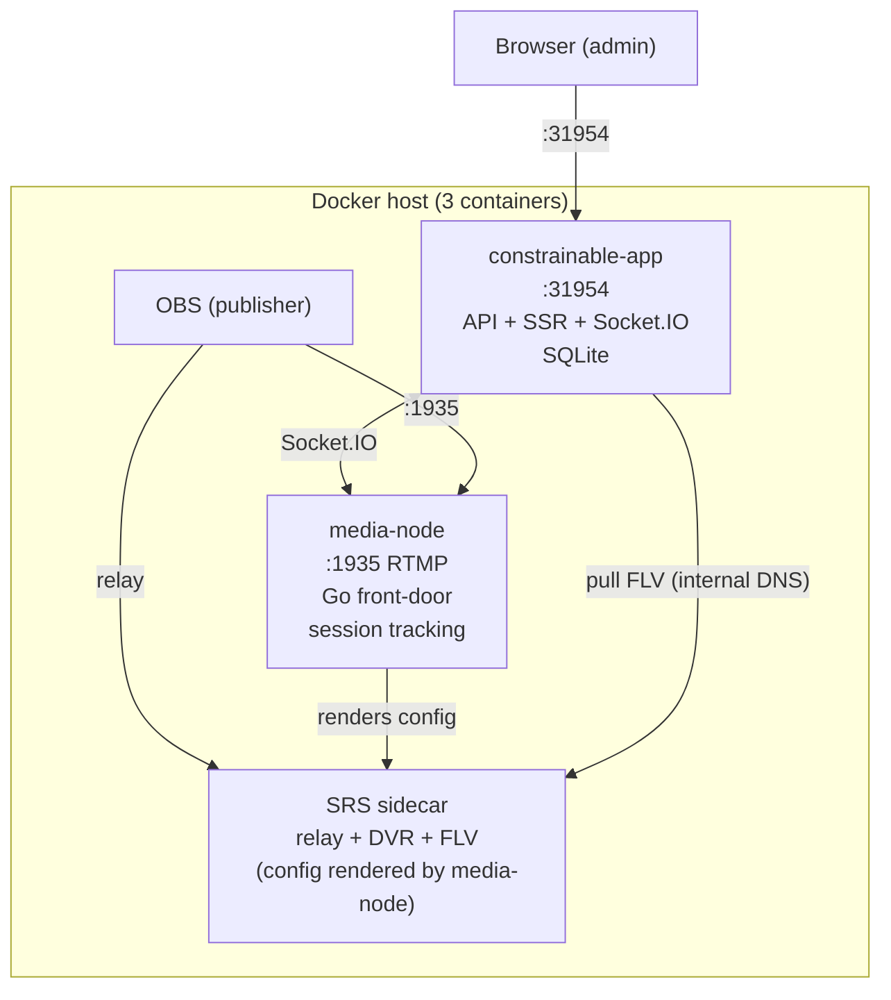

# constrainable-ingest

Deployment orchestrator for the Constrainable Ingest proctoring platform. This repo contains **only** docker-compose + docs. Code lives in two separate repos, coupled at runtime via GHCR images.

## Repository Structure

| Repo | Role | Image |
| ------ | ------ | ------- |
| [constrainable-app](https://github.com/hnrobert/constrainable-app) | Nuxt frontend + API backend + Socket.IO + admin dashboard | `ghcr.io/hnrobert/constrainable-app` |
| [constrainable-media-node](https://github.com/hnrobert/constrainable-media-node) | Go RTMP front-door + SRS config owner (SRS runs as a sidecar) | `ghcr.io/hnrobert/constrainable-media-node` |
| **constrainable-ingest** (this repo) | docker-compose + deployment docs | — |

## Quick Deploy

```bash
git clone https://github.com/hnrobert/constrainable-ingest.git
cd constrainable-ingest

# Configure
cp .env.example .env
# Edit .env: set PUBLIC_HOST and SESSION_SECRET

# Start
docker compose up -d
```

## Architecture



### RTMP auth levels (single :1935 port)

| OBS setting | Auth path | Who can push |
| ------------- | ----------- | ------------- |
| Use authentication **ON** | authmod challenge → account verify | Users with a website account |
| Use authentication **OFF** | credless pass-through → event-key check | Anyone with the event key |

## Ports

| Port | Service | Used by |
| ------ | --------- | --------- |
| 31954 | constrainable-app | Browser (web UI, API, Socket.IO) |
| 1935 | media-node | OBS (RTMP push) |

SRS's ports (38081 FLV / 1985 API) are internal to the Docker network: the app backend pulls playback from SRS by its service name and viewers play through the app's same-origin proxy — nothing outside Docker reaches SRS directly.

## Scaling

Run additional media-nodes on other servers:

```bash
# On a remote server (uses the media-node repo's compose: node + SRS sidecar)
git clone https://github.com/hnrobert/constrainable-media-node && cd constrainable-media-node
API_ORIGIN=http://central-server:31954 \
SELF_ORIGIN=remote-node-1 \
SRS_FLV_BASE=http://remote-node-1:38081 \
docker compose up -d
```

Each media-node registers with the central backend and handles publishers in its region.

## Documentation

- [Deployment Guide](docs/DEPLOY.md) — detailed setup
- [CDN Guide](docs/CDN.md) — frontend on CDN for nationwide access
- [Streaming Architecture](docs/STREAMING.md) — technical deep-dive

## Development

Clone the code repos separately:

```bash
git clone https://github.com/hnrobert/constrainable-app.git
git clone https://github.com/hnrobert/constrainable-media-node.git
```
