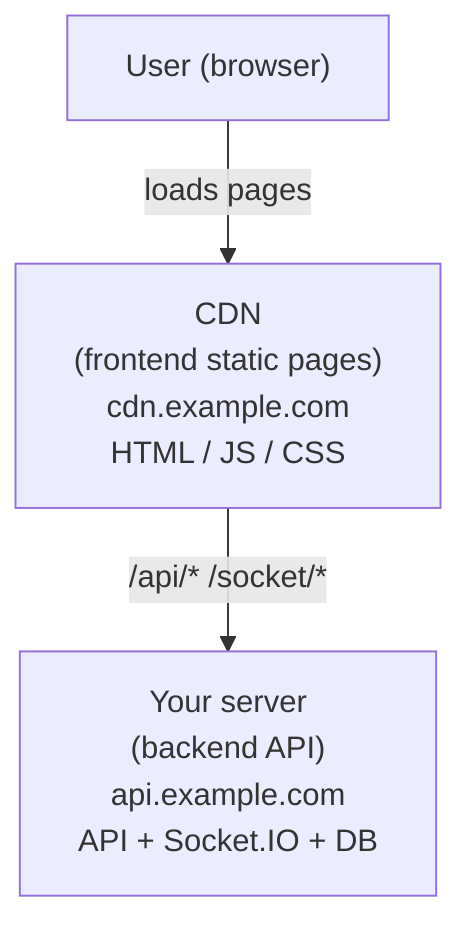
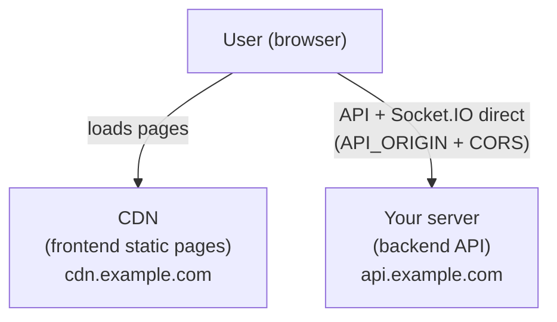

# CDN Deployment Guide — Static Frontend + Remote API

How to deploy the frontend as pre-generated static pages on a CDN (Alibaba Cloud OSS + CDN, Tencent Cloud EdgeOne, or Cloudflare Pages) while the backend API runs on your own server. This gives sub-50ms page loads nationwide for 100+ concurrent users.

## Architecture



## Step 1 — Generate static pages

```bash
bun run generate
```

Output: `.output/public/` (static HTML/JS/CSS/favicon). This directory is what you upload to the CDN.

> **Build runtime must be Bun, not Node.** The `generate` script (`bun …/nuxi.mjs generate`) already forces this — do NOT replace it with a plain `nuxt generate` call: the `nuxt` bin's shebang is `#!/usr/bin/env node`, and prerendering imports the server bundle, which needs the `bun:sqlite` builtin (Node fails with `Only URLs with a scheme in: file, data, and node are supported … Received protocol 'bun:'`). On CDN builders, set the build command to `bun install && bun run generate` and make sure Bun is available.
>
> **Note:** The static output is an SPA shell: the auth middleware redirects `/` to `/login`, so `index.html` (copied from nitro's `200.html` by the generate script) is a meta-refresh to `/login`, after which the client router + `API_ORIGIN` fetches take over. With `API_ORIGIN` set, payload extraction is disabled automatically so data pages fetch LIVE data instead of hydrating build-time output. CDN "default homepage" should be `index.html` with SPA fallback (serve it on unknown paths too).

## Step 2 — Upload to CDN storage

### Alibaba Cloud (OSS + CDN)

1. Create an OSS bucket in the region closest to your users (e.g. `cn-beijing`)
2. Upload the generate output:

   ```bash
   # Using ossutil
   ossutil cp -r .output/public/ oss://your-bucket/ --update
   
   # Or using the Alibaba Cloud console (drag and drop .output/public/* )
   ```

3. Enable static website hosting on the bucket:
   - Default homepage: `index.html`
   - Default 404: `index.html` (SPA fallback for client-side routes)

4. Add a CDN domain pointing to the bucket:
   - Acceleration domain: `cdn.example.com`
   - Origin: your OSS bucket
   - Cache settings:
     - `/_nuxt/**` → 30 days (hashed filenames, immutable)
     - `/index.html` → 60 seconds (must revalidate)
     - `/api/**` → no cache (if routing through CDN, see Step 3)

### Tencent Cloud EdgeOne

> **Use a CUSTOM build, not the auto-detected Nuxt preset.** EdgeOne's Nuxt
> detection builds SSR cloud functions (`.edgeone/cloud-functions/ssr-node`) —
> those run under Node, and this app requires Bun (`bun:sqlite`), so the
> function path crashes at runtime. In project settings set:
> 框架/preset = None (custom) · build command = `bun install && bun run generate`
> · output directory = `.output/public` (contains `index.html`).

1. Go to [EdgeOne Console](https://console.cloud.tencent.com/edgeone) → create a site (or add an accelerated domain)
2. Upload static files to EdgeOne's file storage or connect to an origin server:
   - **Option A**: Upload `.output/public/` to COS, set COS as EdgeOne origin
   - **Option B**: Set your backend server as origin, EdgeOne caches static paths only
3. Configure cache rules:
   - `/_nuxt/**` → cache 30 days (hashed filenames, immutable)
   - `/index.html` → cache 60s, follow origin `Cache-Control`
   - `/api/**` → no cache, proxy to backend
   - `/socket/*` → no cache, enable WebSocket
4. Add an edge function (optional) for SPA fallback:

   ```js
   // EdgeOne edge function: SPA fallback
   async function handle(request) {
     const url = new URL(request.url)
     const resp = await fetch(request)
     if (resp.status === 404 && !url.pathname.startsWith('/api/') && !url.pathname.startsWith('/_nuxt/')) {
       return fetch(new URL('/index.html', url.origin))
     }
     return resp
   }
   ```

5. Configure origin rules for API routing:
   - `/api/*` → origin: `http://your-server-ip:31954`, no cache
   - `/socket/*` → origin: `http://your-server-ip:31954`, no cache, WebSocket on

### Cloudflare Pages

```bash
bun run generate
# Push to Git → Cloudflare Pages → build command: bun run generate → output: .output/public
```

Cloudflare automatically handles SPA fallback and cache headers.

## Step 3 — Route API calls to your backend

The generated pages make API calls to relative paths (`/api/...`). You have two options:

### Option A: CDN origin rules (recommended — zero code changes)

Configure your CDN to NOT cache `/api/*` and `/socket/*` and instead forward them to your backend server:

**EdgeOne / CDN → Origin Rules:**

- Rule 1: `Path = /api/*` → origin: `http://your-server-ip:31954`, no cache
- Rule 2: `Path = /socket/*` → origin: `http://your-server-ip:31954`, no cache, enable WebSocket
- Rule 3: everything else → origin: OSS bucket, cache per Step 2

**Cloudflare → Page Rules / Workers:**

- `/api/*` → Resolve Override: `api.example.com`
- `/socket/*` → Resolve Override + WebSocket: on

With this approach, the frontend and API are same-origin from the user's perspective — no CORS, no cookie changes needed.

### Option B: Separate API origin (API_ORIGIN + CORS_ORIGINS)

If your CDN can't proxy `/api/*` and `/socket/*` (or you simply prefer direct browser → API traffic), the app has first-class support built in: one env var on each side, no code changes.

**Frontend — `API_ORIGIN`** (where browser API + Socket.IO traffic goes; baked at generate time):

```bash
API_ORIGIN=https://api.example.com bun run generate
```

Unset → same-origin (the default deployment, zero behavior change). When set, a client plugin rewrites every `/api/*` fetch to the API origin with credentials (`app/plugins/api-origin.client.ts`), and the Socket.IO client connects there too (`app/composables/useSocket.ts`).

**Backend — `CORS_ORIGINS`** (which frontend origins may send credentialed cross-origin requests):

```bash
CORS_ORIGINS=https://cdn.example.com docker compose up -d
```

Setting it enables three things: the CORS middleware (echoes the allowed origin with credentials — never `*`), Socket.IO handshake CORS restricted to the same list, and the session cookie switched to `SameSite=None; Secure`.

**HTTPS on the API origin is mandatory in this mode** — browsers reject `SameSite=None` without `Secure`, so the login cookie would not persist. Any CDN/LB in front of the API origin must also pass WebSocket upgrades through for `/socket/*`.



Option A vs B: A keeps everything same-origin (no CORS/cookie complexity, but the CDN must proxy API paths); B needs the two env vars + HTTPS but no CDN routing rules at all.

## Step 4 — Configure your backend

The backend server runs in Docker as usual:

```bash
# On your ECS/cloud server
PUBLIC_HOST=api.example.com \
SESSION_SECRET=long-random-string \
AUTHMOD_VERIFIER_SECRET=another-long-random-string \
docker compose -f docker/docker-compose.yml up server
```

If using Option A (CDN origin rules), no backend changes needed — the CDN proxies to the same origin.

## Step 5 — Verify

1. Visit `https://cdn.example.com` — page loads from CDN (check response headers for CDN cache hit)
2. Login — auth cookie is set (same-origin via CDN proxy, or cross-domain with CORS)
3. Open dashboard — real-time metrics flow via Socket.IO
4. Open an event guide (`/e/<slug>`) — loads from CDN, API data fetched from backend

## Cache purge after redeploys

When you deploy a new frontend version:

```bash
bun run generate
ossutil cp -r .output/public/ oss://your-bucket/ --update
# Purge CDN cache for index.html (hashed /_nuxt/ files don't need purging)
aliyun cdn RefreshObjectCaches --ObjectPath https://cdn.example.com/index.html --ObjectType File
```

## Troubleshooting

| Issue | Cause | Fix |
| --- | --- | --- |
| API 404 from CDN | CDN not routing /api/* to backend | Check origin rules (Step 3A) |
| Login doesn't persist | Cookie blocked cross-domain | Use Option A (same-origin), or Option B with HTTPS on the API origin (`SameSite=None; Secure` is automatic when `CORS_ORIGINS` is set) |
| Socket.IO disconnects | CDN blocking WebSocket | Enable WebSocket pass-through on /socket/* rule |
| Page loads but data empty | API base URL wrong | Check `API_ORIGIN` (Option B) or CDN origin rules (Option A) |
| Old version after deploy | CDN cache not purged | Purge index.html (hashed assets auto-update) |
