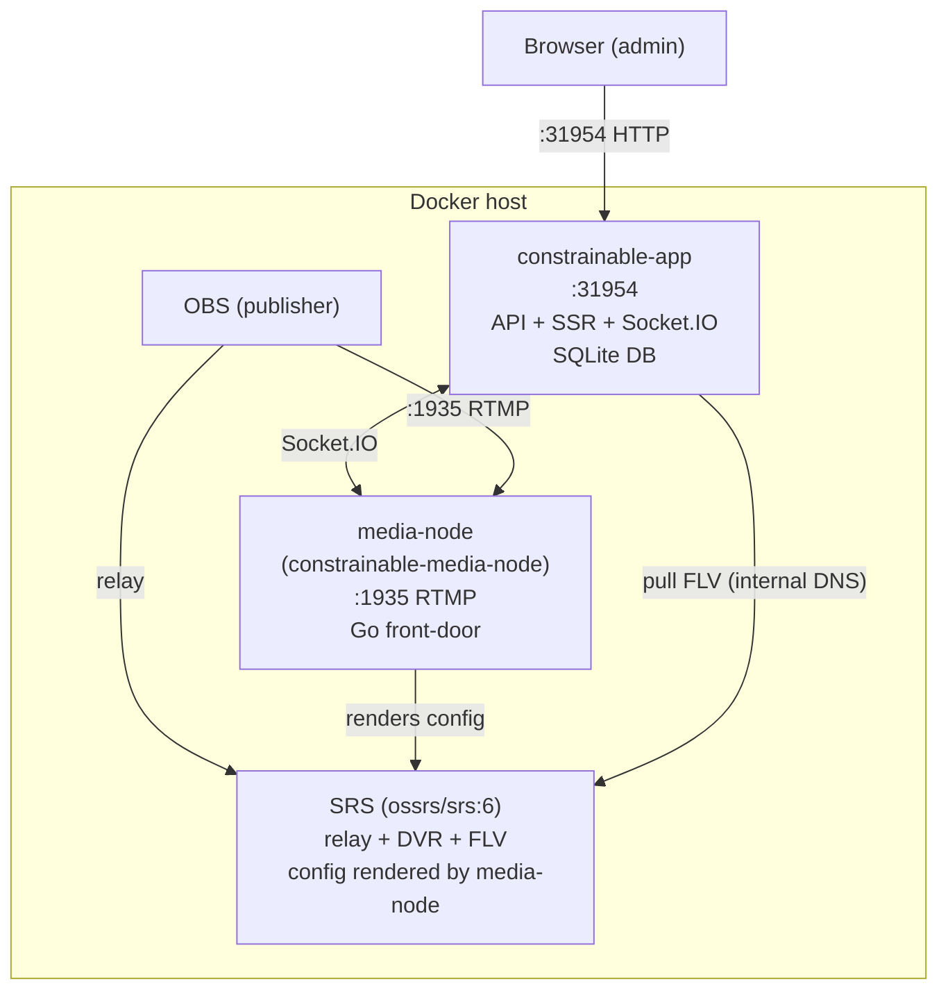
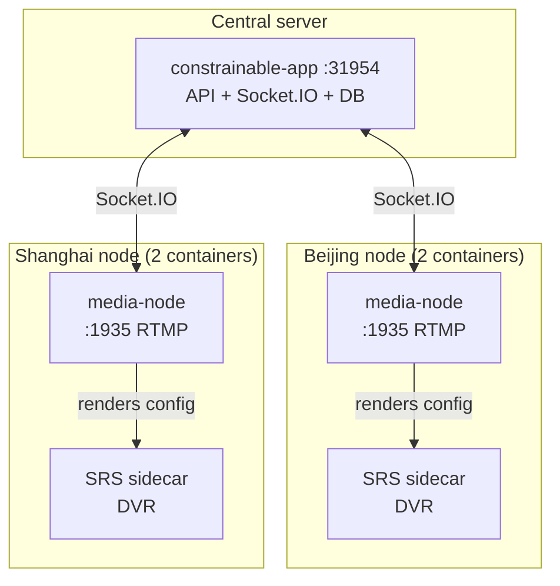

# Deployment Guide — GHCR Images

Deploy the full stack (backend + Go media-node) using pre-built GHCR images. No source code, no building — just pull and run.

## Architecture (single server, 3 containers)



Single RTMP entry point (:1935), two auth levels:

- OBS "Use authentication" **ON** → account auth (identity-bound proctoring)
- OBS "Use authentication" **OFF** → credless, event-key check (quick access)

## Quick Start

### 1. Download the compose file

```bash
mkdir constrainable-ingest && cd constrainable-ingest
curl -O https://raw.githubusercontent.com/hnrobert/constrainable-ingest/main/docker-compose.yml
```

### 2. Create `.env` (optional but recommended)

```bash
cat > .env << 'ENVEOF'
# Required
SESSION_SECRET=$(openssl rand -hex 32)
AUTHMOD_VERIFIER_SECRET=$(openssl rand -hex 32)

# Optional — leave empty for no auth between backend and media-node
# MEDIA_NODE_AUTH_TOKEN=$(openssl rand -hex 32)

# Optional — WebRTC (WHEP) playback only: the public IP browsers' ICE should
# target. FLV playback (default) and OBS ingest need NO host configuration —
# OBS URLs are derived from wherever users browse the app.
# PUBLIC_HOST=192.168.1.100

TZ=Asia/Shanghai
ENVEOF
```

### 3. Start

```bash
docker compose up -d
```

### 4. Verify

```bash
# Backend is up
curl http://localhost:31954/api/health

# Media-node's SRS is up (API is internal to the Docker network)
docker compose logs media-node 2>&1 | grep -q "API is up" && echo "SRS API reachable"

# Both containers running
docker compose ps
```

## Configuration

All configuration is via environment variables in `.env` or the compose file.

### Required

| Var | Description |
| ----- | ------------- |
| `SESSION_SECRET` | JWT signing secret. Generate: `openssl rand -hex 32`. |

No host/IP configuration is required: OBS ingest URLs are derived at runtime
from the origin users browse the app at, and playback is same-origin.

### Optional

| Var | Default | Description |
| ----- | --------- | ------------- |
| `AUTHMOD_VERIFIER_SECRET` | auto | AES key for authmod verifier encryption. |
| `MEDIA_NODE_AUTH_TOKEN` | _(empty)_ | Shared secret between backend and media-node. Empty = no auth. |
| `PUBLIC_HOST` | _(auto)_ | WebRTC ICE candidate override + explicit ingest-host override. |
| `SRS_RTC_CANDIDATE` | _(derived)_ | WebRTC ICE candidate browsers connect to (UDP); derived from the OBS authority host (`PUBLIC_RTMP_AUTHORITY`/`NODE_IDENTIFIER`). |
| `SRS_UDP_PORT` | `8000` | Host UDP port mapped to SRS :8000 (WebRTC media) — must be open in the firewall. |
| `ICE_SERVERS` | _(empty)_ | STUN/TURN servers for admin WebRTC viewers — JSON array or comma list (`turn:user:pass@host:port` shorthand works). Empty = direct-only (SRS is ICE-lite). |
| `CORS_ORIGINS` | _(empty)_ | Split deployment: allowed frontend origins (see docs/CDN.md Option B). |
| `NODE_IDENTIFIER` | `media-node` | Media-node's public identifier (multi-node deployments). |
| `TZ` | `Asia/Shanghai` | Timezone for recordings directory naming. |

## Data persistence

| Host path | Container path | Contents |
| ----------- | --------------- | ---------- |
| `./data/` | `/app/data/` | SQLite database (users, events, sessions) |
| `./records/` | `/records/` | DVR recording files (FLV) |

Backup: copy the `data/` directory. Recordings can be backed up or offloaded separately.

## Same host, separate compose projects

The app and media-node may run as two independent compose projects on one
machine (each repo's own docker-compose.yml). Service names do NOT resolve
across compose projects by default — connect them with a shared external
network (once):

```bash
docker network create ingest-shared
```

Uncomment the `ingest-shared` blocks in BOTH compose files (app + media-node),
then point the node at the app by service name as usual:

```yaml
# media-node compose
API_ORIGIN: http://app:31954
```

Everything stays on the container network — no published ports or host
firewall involvement. Quick alternative without shared networking:
`API_ORIGIN: http://host.docker.internal:31954` plus
`extra_hosts: ["host.docker.internal:host-gateway"]` on Linux (routes through
the host's published port). Set `MEDIA_NODE_AUTH_TOKEN` (same value on both
sides) — traffic is no longer isolated to one compose network.

## Scaling to multiple servers

The backend (`constrainable-app`) is the control plane. Media-nodes can run on additional servers:



Each media-node:

- Connects to the central backend via Socket.IO
- Registers itself (backend routes viewers to the right node)
- Runs with its own SRS sidecar container (recording stays local)
- Owns the SRS config (template embedded in the node image, rendered at startup)

```bash
# On a remote server (node + SRS sidecar via the media-node repo's compose)
git clone https://github.com/hnrobert/constrainable-media-node && cd constrainable-media-node
API_ORIGIN=http://central-server:31954 \
NODE_IDENTIFIER=shanghai-node \
PUBLIC_RTMP_AUTHORITY=shanghai-node \
SRS_RTC_CANDIDATE=shanghai-node \
SRS_FLV_BASE=http://backend-reachable-srs-host:38081 \
docker compose up -d
```

## Ports

| Port | Service | Protocol | Used by |
| ------ | --------- | ---------- | --------- |
| 31954 | constrainable-app | HTTP | Browser (web UI, API, Socket.IO) |
| 1935 | media-node | RTMP | OBS (push streaming) |

**Playback is WebRTC-only** — browsers get media directly over UDP (`SRS_UDP_PORT`, default 38000, published on the srs service; must be open in the firewall, and the candidate host must resolve straight to the node — DNS-only, not a CDN edge). The SDP signaling rides the app's admin-gated same-origin proxy, so no media session can start unauthenticated. SRS's HTTP ports (38081 FLV / 1985 API) stay internal: only the app pulls FLV server-side for frame capture (the node derives and advertises `http://srs:<SRS_HTTP_PORT>` from SRS_ADDR — in one compose or a shared network that name resolves; standalone remote nodes override SRS_FLV_BASE to whatever the backend can reach).

## Updating

```bash
docker compose pull
docker compose up -d
```

## Troubleshooting

| Issue | Check |
| ------- | ------- |
| Page loads but API 404 | request not reaching the app container; check `docker compose ps` and port 31954 |
| OBS can't connect | Port 1935 blocked by firewall; check `docker logs constrainable-media-node` |
| No recordings | Check `./records/` is writable; check SRS log in media-node container |
| Media-node not registering | Check `API_ORIGIN` is reachable from the media-node container |
| Wrong stream metrics | SRS API might be slow to start; wait 15s after first publish |
