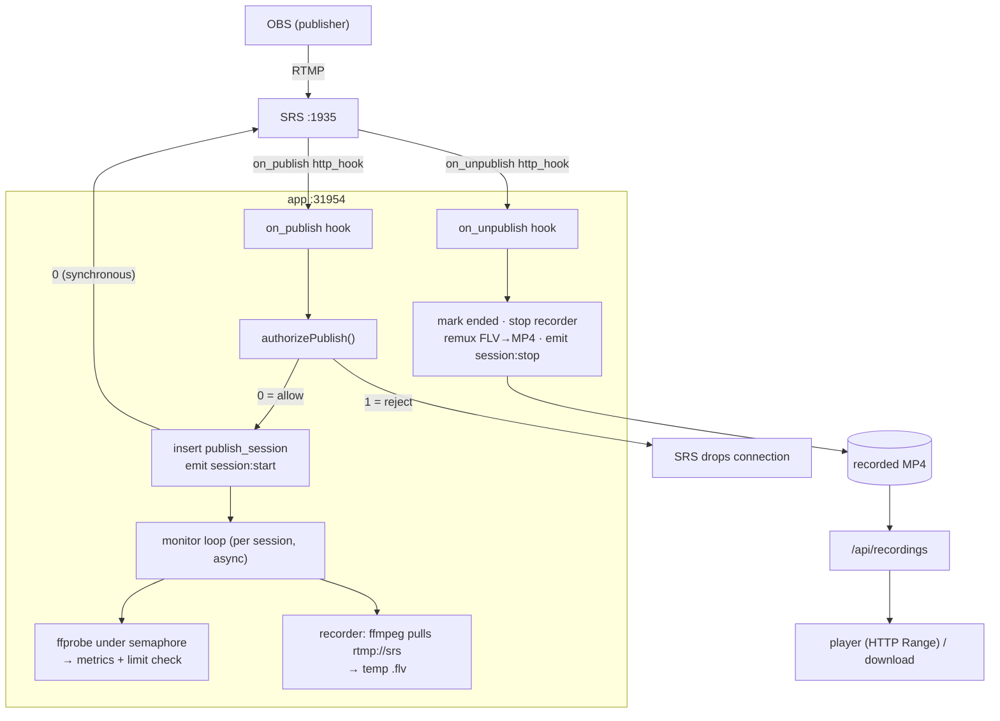

# Streaming, testing & capacity

How RTMP ingest flows through the stack, how to test it (manually with OBS and automated with the stress harness), and how many concurrent streams the single-machine `docker compose` deployment can actually sustain — with the measurements behind those numbers.

## Ingest architecture



The app is the **orchestration layer**: it never receives media directly. SRS holds the RTMP connection and calls the app back over HTTP hooks (`docker/srs.conf`, `vhost __defaultVhost__ → http_hooks`). The app returns a plain-text `"0"`/`"1"` synchronously; SRS drops the connection on anything ≠ `"0"` or a non-200.

### Publish authorization (`server/services/access-control.ts`)

Three paths, first match wins:

1. **Stream key** — looked up by `streamName`, then the `?token=` suffix is argon2id-verified against the stored hash.
2. **Shared event credential (`?token=` resolves an event)** — the `?token=` (≥8 chars) is first compared **verbatim** against `events.publishKey`, then, if that fails, argon2id-verified as a per-event publish token. Either match resolves the event. **This is the path the participant guide uses.**
3. **Open mode** — `access.rejectUnknownPublishers=false`: any unknown stream name is allowed (used for load testing and trusted-LAN deployments).

**Shared publish key (the guide's auth model).** The organizer sets one shared `publishKey` per event (`POST /api/events/:id/publish-key`). Each contestant pushes `<accountEmail>?token=<publishKey>`. The stream *name* (their email) is unique per person, while only the token is shared, so **the whole class can publish concurrently with one key** — SRS allows one publisher per stream *name*, not per token. The key is stored **verbatim** (retrievable) by design: it is displayed on the guide to every authorized viewer, so it is not a per-person secret (unlike the argon2id-hashed paths above).

An event is rejected only when `status==='archived'`; `withinWindow` enforces only *set* start/end bounds (unset = always in window). Exact `reject_reason` strings: `event closed`, `event not started`, `event ended`, `missing token`, `bad token`, `key revoked`, `unknown stream name`.

### Participant guide (`GET /api/events/slug/:slug/guide`)

A self-serve, **event-customized** push-streaming guide, identical for every viewer of the same event. Allowlisted (no auth at the middleware) but **visibility-gated** server-side: a `public` event needs no login; `registered`/`groups` require a session (+ group membership); `draft`/`archived` or a missing slug return `404` (no existence leak). The payload carries the RTMP `server`, the shared `publishKey` in full, recommended output settings (merged global + `limitsOverride`), the event time window, and the organizer's free-text `streamGuide` notes. Page: `app/pages/e/[slug].vue` (`/e/<slug>`).

The two stream-key models (per-student vs. shared guide key) coexist; the publish-key path is purely additive.

### OBS "Use authentication" — how it works, why we don't use it for account auth

A natural idea is to require each contestant to authenticate with their **website account** inside OBS' native *Settings → Stream → Use authentication* (username + password), and have the app verify those at push time. The fields **do** work — but only under conditions our stack doesn't meet. Verified 2026-08-14 against OBS 30.0.2 / macOS with a hand-written fake RTMP server that completes the full handshake (so OBS ran its entire `connect → releaseStream → FCPublish → createStream → publish` sequence) and implements the Adobe authmod challenge server-side.

**The fields are only sent when the *server* challenges.** With no challenge (default SRS behavior — `use_auth=true`, `username`/`password` set), OBS' `connect` AMF0 object carried only `app`, `type`, `flashVer`, `swfUrl`, `tcUrl`: **no username/password anywhere** — not in the connect object, not as `user:pass@` in tcUrl, not as an auth query string. The credentials stay in OBS until the server asks for them. (RTMP forwards only `stream` + `param` to `on_publish` regardless — never handshake credentials.)

**When the server issues an Adobe `authmod=adobe` challenge, OBS (librtmp) runs a three-connection challenge-response dance** — this is exactly the mechanism DaCast / Wowza / FMS use, and OBS bundles librtmp to implement it:

| Conn | `app` field OBS sends | server reply |
| --- | --- | --- |
| 1 | `live` | `_error` "code=403 need auth, authmod=adobe" |
| 2 | `live?authmod=adobe&user=<U>` | `_error` "?reason=needauth&salt=\<S\>&opaque=\<O\>" |
| 3 | `live?…&challenge=<C>&response=<R>&opaque=<O>` | verify `R`, `_result` Success |

The username appears from conn 2; a password-derived `response` from conn 3. The password itself never travels — only

```text
response = base64( md5( base64(md5(user + salt + password)) + opaque + challenge ) )
```

where `salt`/`opaque` are server-chosen (conn 2) and `challenge` is a random OBS generates and echoes each time (so a captured response can't be replayed). This is reproduced from librtmp's `PublisherAuth()` (`librtmp/rtmp.c`); the bundled `obs-outputs` plugin confirms it via `strings` — `authmod=adobe`, `?reason=needauth`, `&challenge=%s&response=%s&opaque=%s`, `md5(%s%s%s)`.

**A server that knows the plaintext password CAN verify it.** Proven live twice with user `robert` / password `123456`: the server recomputed the response from the captured `challenge` and it matched OBS' byte-for-byte — two different random challenges, same formula, exact match (`…Mp+PWA==` → `PY7/wqquUEhReoB84eo3tw==`; `…8LpdeA==` → `XuOWoGAPqjLmC2zcwsUbSQ==`).

**So why not use it for account auth — two remaining walls:**

1. **SRS doesn't issue the challenge.** `ossrs/srs:6` never sends the `authmod` `_error`, so OBS never enters the dance against our server and the username/ password are never produced. nginx-rtmp *also* lacks the Adobe authmod challenge (it auths via an HTTP `on_publish` callback, which still never carries handshake creds), so getting the credentials requires a small RTMP auth **front-proxy** (or an SRS fork) that runs the challenge, verifies `R`, and relays the stream to SRS — non-trivial infra.
2. **Verification needs a password-derived verifier we deliberately don't store.** The formula fixes `md5(user + salt + password)` — the protocol *mandates* md5, so it cannot be strengthened to argon2id/PBKDF2. Verifying therefore needs that exact md5, which the app *could* compute at **registration** (the plaintext is available before argon2id hashing). But storing it is a real downgrade: it is a **password-equivalent** built on a fast, non-memory-hard hash, so a DB leak exposes the login password to offline brute-force far faster than the argon2id column does. (Unlike the shared `publishKey`, which is a random generated secret, not derived from the login password.) Encrypting it at rest mitigates the leak case but doesn't remove the fast-hash weakness inherent to the protocol.

**Conclusion.** The OBS-native "Use authentication" path is *feasible* — the fields work, the mechanism is fully reproducible, and server-side verification is proven — but only behind a custom RTMP challenger *and* at the cost of storing a password-derived md5 verifier. For per-account accountability/revocation **without** those costs, the additive refinement is **per-user tokens in `?token=`** (Track B1'): reuse the existing `stream_keys` / argon2id infra, `<accountEmail>?token=<perUserToken>`, no SRS changes, no OBS auth fields, no weakening of password storage. The probe that produced these findings is a throwaway (`/tmp/rtmp_authmod.py` — handshake + AMF0 dumper + 2-stage authmod challenge + live verifier), not committed.

## Testing with OBS (manual)

With `docker compose up` running, the deploy-time smoke test:

1. **Create an event + roster + keys** in the panel. Copy a student's OBS config: server `rtmp://<PUBLIC_HOST>:1935/live`, key `<streamName>?token=…`.
2. **Push from OBS.** The **Realtime** tab shows a session + live metrics within seconds (Socket.IO, same-origin).
3. **Exceed a limit** (e.g. raise resolution past the configured max). The panel shows a violation, SRS kicks the stream, and the non-compliant stream is not archived.
4. **Stop OBS.** A compliant session produces an MP4 under `records/<date>/`, appears in **Recordings**, and plays inline / downloads.
5. **Reject off-roster** — push with an unknown/revoked token: `on_publish` returns `"1"` and SRS drops the stream (audited).
6. **Hot-reload limits** in **Config** — new pushes use the new thresholds without a restart.

### OBS gotchas (if your push won't stay connected)

- **Canvas FPS must be ≥ ~2.** A 1 FPS OBS canvas emits its first keyframe later than SRS's 5 s publish idle-timeout, so SRS drops the publish (`rtmp: publish timeout 5000ms, nb_msgs=1` in the SRS logs) before any media arrives, and OBS churns in a reconnect loop sending zero bytes. Set Settings → Video → FPS to 30 (or at least single digits). Symptom: OBS reports `outputActive:true` but `outputBytes:0`, and the app never registers a session.
- **Stop before changing video settings.** OBS refuses `SetVideoSettings` while any output is active, and its auto-reconnect (a few seconds) can race a stop. Stop the stream, confirm `outputActive:false`, then reconfigure.

## Automated stress harness

`scripts/stress-streams.ts` emulates many OBS clients from one machine. It pushes N concurrent ffmpeg streams — a looped clip with `-c copy`, so each pusher uses ~zero CPU and a laptop can emulate dozens of publishers — and samples, while the streams are live:

- how many of *its own* streams are actively publishing on SRS (by `recv_bytes` growth — see "Measurement gotchas" below),
- how many the app has registered as a publish session and marked compliant,
- the app container's CPU% and memory (via `docker stats`).

Two modes:

- `--mode auth` — mints a per-event publish token and pushes every stream as `<stream>?token=<token>` (the real OBS path; exercises argon2id verification).
- `--mode open` — temporarily sets `access.rejectUnknownPublishers=false` and pushes with no token (isolates raw ingest/recording capacity). Restored on exit.

```bash
# bring the stack up first
docker compose -f docker/docker-compose.yml up -d --build

# single run, real auth path
bun run stress --count 20 --hold 15

# capacity ramp in open mode (isolates SRS + recorder from the auth hot path)
bun run stress --ramp 10,25,50,75,100 --mode open --hold 15

# peek at every flag
bun run stress --help
```

The harness mints its own admin session JWT (signed with `SESSION_SECRET`, uid 1) against the running app, so it needs no browser login.

## Measured capacity (single machine, `docker compose`)

Source clip: 640×360 / 25 fps / ~285 kbps (H264+AAC), pushed with `-c copy`. Hardware: Apple Silicon laptop, Docker Desktop, SRS `ossrs/srs:6`. Numbers are **concurrent actively-publishing streams** (all pushers alive, `recv_bytes` growing linearly), in **open mode** unless noted.

| Concurrent pushers | SRS streams active | Aggregate ingest | App container |
| ---: | ---: | ---: | --- |
| 10 | 10 | ~0.4 MB/s (~3 Mbps) | ~230 MiB |
| 25 | 25 | ~0.8 MB/s (~6 Mbps) | ~380 MiB |
| 50 | 50 | ~1.6 MB/s (~13 Mbps) | ~650 MiB |
| 75 | 75 | ~4.5 MB/s (~36 Mbps) | ~1.3 GiB |
| 100 | 100 | ~4.3 MB/s (~34 Mbps) | ~1.8 GiB, ~120% CPU |
| 150 | 150 | ~6.1 MB/s (~49 Mbps) | ~1.3 GiB |
| 250 | collapses to ~30 | — | SRS CPU saturates (~104%) |

**Takeaways:**

- **Up to ~100–150 concurrent streams: clean, linear scaling.** Every requested stream actively publishes; throughput scales with stream count. This is the comfortable operating range on one machine.
- **The ceiling (~200–250) is SRS's single CPU core.** SRS runs its single-threaded "Hybrid" server on one core, and each stream carries extra per-stream work here (RTMP→WebRTC bridge + HTTP-FLV remux + a recorder pull). Past ~200, SRS saturates the core, connections collapse, and most pushers die. *Not* the application, *not* the network.
- **The mid-range cost is the recorder.** Each recorded stream spawns one ffmpeg in the app container (~15–18 MiB each), capped by `record.maxConcurrency` (default 100). At 100 streams that is ~1.8 GiB and ~1.2 cores of recorder + probe work — the dominant app-container resource.

### Scaling higher

- **Give SRS more headroom:** disable `rtc.rtmp_to_rtc` in `srs.conf` if WebRTC playback isn't needed (removes per-stream bridging), and/or shard SRS.
- **Raise the recorder cap:** increase `record.maxConcurrency` and `concurrency. probeMax` in **Config**, and provision the app container with more CPU/RAM.
- **Disk/bandwidth:** 150 streams × ~285 kbps ≈ 49 Mbps ingress + an equal recorder egress; size the network and `RECORD_DIR` volume accordingly.

### Why auth mode scales lower (~15–20 concurrent *new* publishers)

In `--mode auth`, each `on_publish` does a **synchronous argon2id token verify** (`server/utils/password.ts`, via `@noble/hashes/argon2.js` / `Bun.password.verify`) on the single-threaded event loop. argon2id is intentionally slow, so a burst of ~15–20 *simultaneous new* publishes blocks the loop long enough that SRS's on_publish webhook responses stall → SRS drops the publishers → ffmpeg reconnects → more verifies → cascade. Measured with the same harness:

| Mode | N=20 concurrent new publishes |
| --- | --- |
| `--mode open` (no verify) | **20/20** actively publishing |
| `--mode auth` (argon2id per publish) | degrades — 0/20 stably publishing |

Important: this is a **connection-rate** bottleneck, not steady-state. The verify runs once per *connection*; an already-connected publisher streams indefinitely without re-verifying. So a roster that connects over a few seconds (real proctoring) is fine; only a tight burst of dozens of simultaneous connect-ups is affected. Mitigations: open mode for trusted networks, staggered start times, or offloading argon2id to a worker thread (future work).

## Measurement gotchas (read before writing your own probe)

Two SRS behaviors will make a naive probe report a phantom "cap of ~10 streams." The harness handles both; any new tooling must too.

1. **The SRS HTTP API paginates with a default page size of 10.** `GET /api/v1/streams/` and `/api/v1/clients/` return only the first 10 entries unless you pass `?count=`. A query without it looks identical to a hard concurrency limit (streams/clients both "stuck at 10"). **Always pass `?count=1000`** (or larger). This was the root cause of an apparent "plateau of 5" during initial testing — it was never a real limit.
2. **`publish.active` is not a reliable "publishing right now" flag.** It reads `false` mid-publish and right after connect, even for streams that are clearly sending data (a stream can have megabytes of `recv_bytes` and still report `active:false`). The reliable signal is **`recv_bytes` growth** between samples. Scope the check to your own stream names — SRS carries leftover entries and recorder-pull entries that otherwise inflate the count.

`ret=1007` (`client disconnect peer`) in the SRS logs is **not** an error — it is SRS's normal "the peer closed the TCP connection" line, emitted on every unpublish. It is only worth investigating when it appears unexpectedly and in volume (e.g. the auth-mode cascade above).

## Operational notes

- **`drizzle-kit` under Bun needs `@libsql/client`, not `better-sqlite3`.** The image installs `@libsql/client`; `better-sqlite3` is a NAPI addon that panics Bun on linux/arm64. `drizzle-kit` checks `@libsql/client` first, so this is picked up automatically — no `drizzle.config.ts` change is needed (the bare `DB_PATH` is normalized for libsql). `server/database/db.ts` verifies the schema synced at boot and refuses to start otherwise.
- **Recordings persist** via the shared `./records` volume: SRS native DVR writes `records/<stream>/<timestamp>.flv` directly from the stream (no external process on the node); the media-node scans and reports segments (`recording:ready`); the app serves them through ffmpeg (remux pipe) with snapshots also spawned on the app. ffmpeg/ffprobe therefore stay in the APP image; the media-node image needs neither. (The app-side real-time MKV recorder remains only for dev/local sessions — SRS-hook driven — and is dormant in the Docker deployment.)
- **Playback routing is two-mode:** single-server deployments (no `PUBLIC_ORIGIN` on the node) play through the app's same-origin proxy (`/api/streams/live/<s>` → the app pulls from the internal SRS) — video bandwidth transits the app, which is fine for one box. Multi-node deployments set `PUBLIC_ORIGIN` per node: `/api/streams/url` then returns a SIGNED absolute URL (`${PUBLIC_ORIGIN}/live/<s>.flv?exp&sig`) and browsers pull DIRECTLY from the node's `PLAY_PORT` (:38080) — playback bandwidth never touches the control plane. Each direct pull is authorized in real time: the node relays `exp`/`sig` to the app over Socket.IO (`play:auth` ack, fail-closed 5s), the app verifies the HMAC it minted (admin-gated URL) + that the stream is live, then the node reverse-proxies the FLV from its SRS sidecar (`FlushInterval=-1`, wildcard CORS). The signing secret (`MEDIA_NODE_AUTH_TOKEN`) never leaves the control plane.
